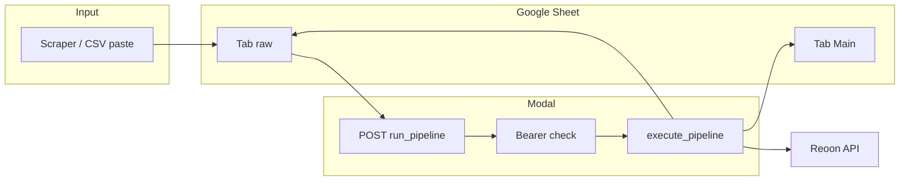

# Lead Pipeline — Automated Lead Processing System

Paste raw leads into a Google Sheet, trigger the pipeline with a **Bearer-protected** HTTP POST, get deduplicated and email-verified rows appended to your main tab.

**What it does**

1. Reads raw leads from a `raw` tab in your Google Sheet
2. Deduplicates against existing leads (LinkedIn URL + email)
3. Verifies every email via Reoon (or swap the verifier function)
4. Appends only verified leads to your `Main` tab
5. Clears the `raw` tab after a successful run

## Architecture



## Security

- **HTTP trigger requires** `Authorization: Bearer <PIPELINE_AUTH_TOKEN>`. Set `PIPELINE_AUTH_TOKEN` in Modal secret `lead-pipeline-secrets` (same place as your other keys).
- **Email verification fails closed**: if Reoon errors or times out, the lead is **not** appended (safer than treating errors as “valid”).
- Never commit `.env` or service account JSON. This repo ships `.env.example` only.

## What you need

- Python 3.11+
- [Modal](https://modal.com) account
- [Reoon](https://reoon.com/) (or change `verify_email_reoon` for another provider)
- Google Cloud service account with Sheets API + sheet shared with that email
- Sheet tabs named exactly: `raw` and `Main`

## Installation (local / dev)

```bash
python3 -m venv .venv
source .venv/bin/activate
pip install -r requirements.txt
python -m modal setup
```

## Modal secret (one-time)

Create or update the secret **including** the bearer token used by callers:

```bash
modal secret create lead-pipeline-secrets \
  REOON_API_KEY="your_email_verifier_key" \
  GOOGLE_SHEET_ID="your_sheet_id" \
  GOOGLE_SERVICE_ACCOUNT_JSON='{"type":"service_account",...}' \
  PIPELINE_AUTH_TOKEN="$(openssl rand -hex 32)"
```

`PIPELINE_AUTH_TOKEN` must match what you send in the `Authorization` header.

## Deploy

```bash
modal deploy lead_pipeline.py
```

You get a URL like:

`https://<workspace>--lead-pipeline-run-pipeline.modal.run`

## Usage

1. Paste scraped rows into the `raw` tab (first row = headers).
2. Trigger the pipeline with any HTTP client:

- **Method:** `POST`
- **URL:** your deployed Modal endpoint (from `modal deploy` output)
- **Header:** `Authorization` must be `Bearer` + the same string as `PIPELINE_AUTH_TOKEN` in your Modal secret (no space after `Bearer` except the single space before the token)

Example with env vars (avoids putting secrets in shell history):

```bash
export MODAL_URL='https://YOUR_WORKSPACE--lead-pipeline-run-pipeline.modal.run'
export PIPELINE_AUTH_TOKEN='(paste from Modal secret lead-pipeline-secrets)'
python -c "import os,urllib.request; u=os.environ['MODAL_URL']; t=os.environ['PIPELINE_AUTH_TOKEN']; r=urllib.request.Request(u, method='POST', headers={'Authorization':'Bearer '+t}); print(urllib.request.urlopen(r).read().decode())"
```

**Response (example)**

```json
{
  "status": "done",
  "raw_leads": 100,
  "fresh_after_dedup": 87,
  "verified_emails": 82,
  "added_to_main": 82
}
```

### Test without HTTP (Modal)

```bash
modal run lead_pipeline.py
```

Runs `execute_pipeline.remote()` (no Bearer — for dev only). Production traffic should go through the deployed HTTPS endpoint with Bearer.

## n8n

Import `n8n-workflow.json`. Set the HTTP node URL to your Modal endpoint and replace `YOUR_PIPELINE_AUTH_TOKEN` in the **Authorization** header with the same value as `PIPELINE_AUTH_TOKEN`.

## Google Sheet layout

**Tab `Main`** — row 1 headers (adjust `rows_to_add` in `lead_pipeline.py` Step 4 if yours differ):

`first_name | full_name | headline | company_name | company_description | company_size | industry | linkedin | email | status | ...`

**Tab `raw`** — paste exports here; pipeline clears it after success.

## Customizing columns

Edit **Step 4** in `lead_pipeline.py` (`rows_to_add`). Field names must match your scraper’s column names in the `raw` tab.

## Safety

- Appends only; never deletes rows from `Main`.
- Deduplicates on LinkedIn URL and email.
- Rows without email are skipped.
- `raw` is cleared only after processing completes.

## Repo hygiene

Copy `.env.example` to `.env` for local experiments only. Before first commit:

```bash
pre-commit install
trufflehog filesystem . --no-update
```

## License

MIT — see [LICENSE](LICENSE).

## Changelog

See [CHANGELOG.md](CHANGELOG.md).
